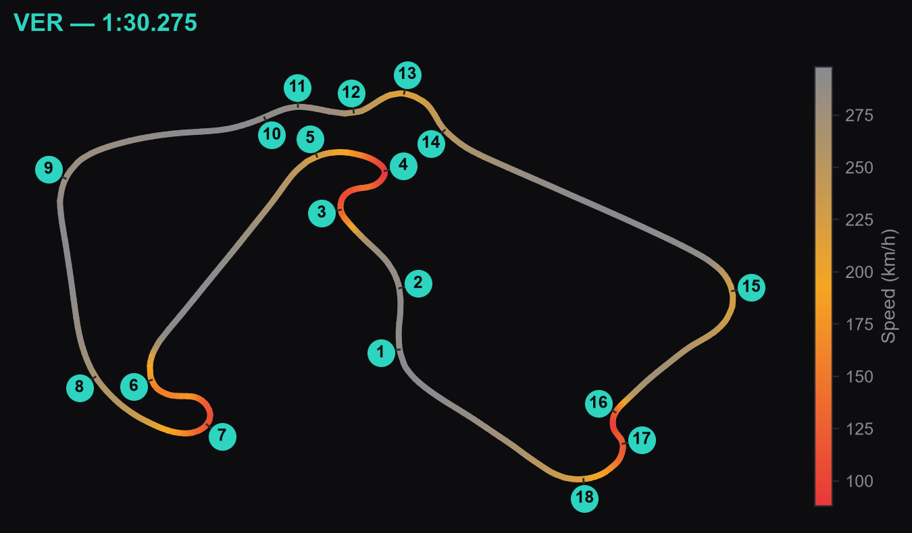
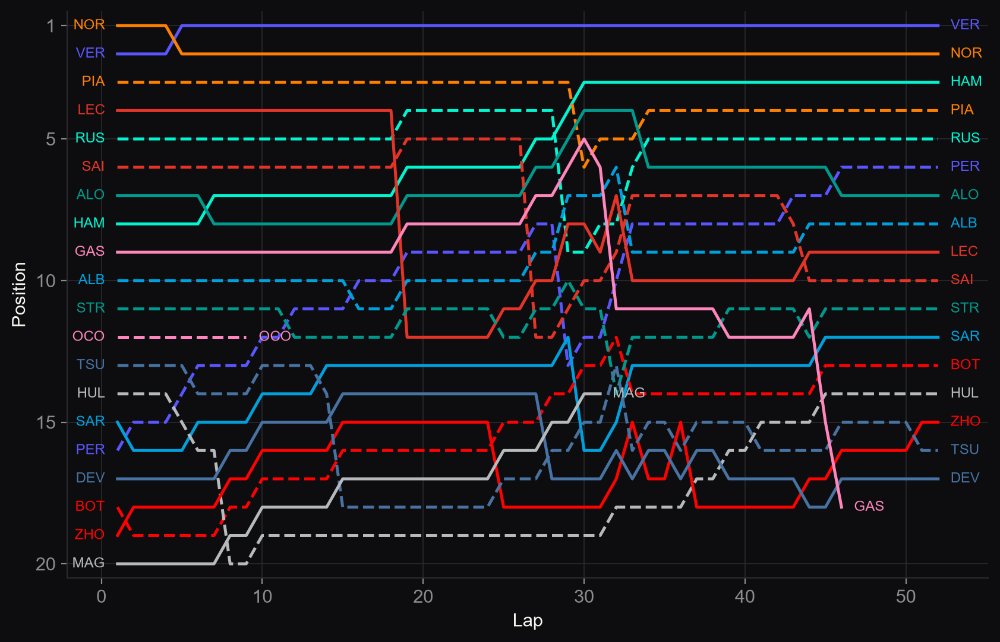

# F1 Snapshot

Understand a historical Formula 1 race at a glance: pick a season and a Grand Prix, see the circuit, the two fastest laps of the race, every tyre strategy, and how the whole race unfolded — one page per race, for any Grand Prix since 2018.

**[Live site Github →](https://leeaky.github.io/f1-snapshot/)**

**[Live site Render →](https://f1-snapshot.onrender.com)**




## What it shows

- **Track map** — the fastest lap of the race, traced corner by corner and coloured by speed (braking zones read hot, straights read cool)
- **Speed traces** — the two fastest individual laps of the race, compared distance for distance
- **Tyre strategy** — every driver's compound choices and stint lengths, in finishing order
- **Position changes** — every position swap, lap by lap, coloured by team

## How it works

A small Flask app (`src/`) that generates all four charts with matplotlib. Races are pre-rendered rather than computed per request: a scheduled GitHub Actions workflow (`.github/workflows/sync-races.yml`) runs weekly, calls FastF1 for any race that isn't cached yet, and commits the resulting images plus a small metadata file back to the repo. The deployed site (Render, free tier) then serves an already-synced race as static files with no FastF1 involvement at all — a race that's never been synced still works, falling back to a live fetch on the spot.

## Running locally

```bash
py -m venv .venv
.venv\Scripts\python.exe -m pip install -r requirements.txt
.venv\Scripts\python.exe -m flask --app src.app run --debug
```

Then open `http://127.0.0.1:5000`. `python -m src.precache <year>` pre-warms a whole season at once (`--rounds N N...` for specific races).

## Credit

Built entirely on [FastF1](https://github.com/theOehrly/Fast-F1) (MIT licensed), which does the real work of pulling and parsing F1 timing, telemetry, and results data. The four visuals here are adaptations of examples from FastF1's own gallery:

- [Annotating corners on a track map](https://docs.fastf1.dev/gen_modules/examples_gallery/general/plot_annotate_corners.html)
- [Overlaying speed traces](https://docs.fastf1.dev/gen_modules/examples_gallery/telemetry/plot_speed_traces.html)
- [Tyre strategies](https://docs.fastf1.dev/gen_modules/examples_gallery/results_strategy/plot_strategy.html)
- [Position changes during a race](https://docs.fastf1.dev/gen_modules/examples_gallery/results_strategy/plot_position_changes.html)

Not affiliated with Formula 1, the FIA, or any team — a personal project for understanding historical races.
